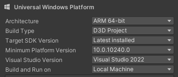

<!-- Improved compatibility of back to top link: See: https://github.com/othneildrew/Best-README-Template/pull/73 -->
<a name="readme-top"></a>
<!--
*** Thanks for checking out the Best-README-Template. If you have a suggestion
*** that would make this better, please fork the repo and create a pull request
*** or simply open an issue with the tag "enhancement".
*** Don't forget to give the project a star!
*** Thanks again! Now go create something AMAZING! :D
-->


<!-- PROJECT SHIELDS -->
<!--
*** I'm using markdown "reference style" links for readability.
*** Reference links are enclosed in brackets [ ] instead of parentheses ( ).
*** See the bottom of this document for the declaration of the reference variables
*** for contributors-url, forks-url, etc. This is an optional, concise syntax you may use.
*** https://www.markdownguide.org/basic-syntax/#reference-style-links
-->
[![Contributors][contributors-shield]][contributors-url]
[![Forks][forks-shield]][forks-url]
[![Stargazers][stars-shield]][stars-url]
[![Issues][issues-shield]][issues-url]


<!-- PROJECT LOGO -->
<br />
<div align="center">
  <a href="https://github.com/elliot-eriksson/M7012E-Discgolf-simulator">
  </a>

<h3 align="center">Disc Golf Simulator for indoor usage</h3>

  <p align="center">
    A proof of concept Disc golf simulator with the use of sensors
    <br />
    <a href="https://github.com/elliot-eriksson/M7012E-Discgolf-simulator"><strong>Explore the docs »</strong></a>
    <br />
    <br />
    <a href="https://github.com/elliot-eriksson/M7012E-Discgolf-simulator/issues">Report Bug</a>
    ·
    <a href="https://github.com/elliot-eriksson/M7012E-Discgolf-simulator/pulls">Request Feature</a>
  </p>
</div>


<!-- TABLE OF CONTENTS -->
<details>
  <summary>Table of Contents</summary>
  <ol>
    <li>
      <a href="#about-the-project">About The Project</a>
      <ul>
        <li><a href="#built-with">Built With</a></li>
      </ul>
    </li>
    <li>
      <a href="#getting-started">Getting Started</a>
      <ul>
        <li><a href="#prerequisites">Prerequisites</a></li>
        <li><a href="#installation">Installation</a></li>
      </ul>
    </li>
    <li><a href="#usage">Usage</a></li>
    <li><a href="#contributing">Contributing</a></li>
  </ol>
</details>


<!-- ABOUT THE PROJECT -->
## About The Project


The project is a disc golf simulator that leverages sensors and HoloLens 2 for an immersive experience. By integrating an IMU sensor (Inertial Measurement Unit) and HoloLens 2, the system tracks the trajectory of a thrown frisbee and visualizes its path in real-time through the HoloLens 2.

Developed as part of the M7012E Pervasive Computing course at Luleå Tekniska Universitet, the project explores the concept of pervasive computing by connecting multiple sensors to interact and exchange data seamlessly.

The current version of the project is built on Unity 2022.3, enabling the program to run on the HoloLens 2 when deployed from Visual Studio. It is divided into two main components: fetching real-time data from the IMU sensor and rendering the data within the HoloLens environment. 


<p align="right">(<a href="#readme-top">back to top</a>)</p>


### Built With

* 
* 
* 
* 


<p align="right">(<a href="#readme-top">back to top</a>)</p>


<!-- GETTING STARTED -->
## Getting Started

This is an example of how you may give instructions on setting up your project locally.
To get a local copy up and running follow these simple example steps.

### Prerequisites


To run this code you will be needing 
* UNITY version 2022.3 [UNITY](https://unity.com/download)

* You will also need the latest version of [Visuals studios](https://visualstudio.microsoft.com/downloads/)

* The equipment that is being used is the [IMU sensor Witmotion WT9011DCLBT50](https://www.wit-motion.com/BLE/17.html) 
and the [HoloLens 2](https://learn.microsoft.com/en-us/hololens/).


### Installation


1. Clone the repo
   ```sh
   git clone https://github.com/elliot-eriksson/M7012E-Discgolf-simulator.git
   ```
2. Download and Install [Unity-Hub](https://unity.com/unity-hub), after that open it up and download the Unity version 2022.3.

3. Open the project in Unity-Hub

### Build And Deploy To The HOLOLENS 2

1. Setup according to these build settings
    
    

2. Deploy using the Visual Studio or Deploy it directly to the HoloLens2

<!-- MARKDOWN LINKS & IMAGES -->
<!-- https://www.markdownguide.org/basic-syntax/#reference-style-links -->
[contributors-shield]: https://img.shields.io/github/contributors/elliot-eriksson/Digital-Product-Passports-DPPs-federated-system.svg?style=for-the-badge
[contributors-url]: https://github.com/elliot-eriksson/M7012E-Discgolf-simulator/graphs/contributors
[forks-shield]: https://img.shields.io/github/forks/elliot-eriksson/Digital-Product-Passports-DPPs-federated-system.svg?style=for-the-badge
[forks-url]: https://github.com/elliot-eriksson/M7012E-Discgolf-simulator/forks
[stars-shield]: https://img.shields.io/github/stars/elliot-eriksson/Digital-Product-Passports-DPPs-federated-system.svg?style=for-the-badge
[stars-url]: https://github.com/elliot-eriksson/M7012E-Discgolf-simulator/stargazers
[issues-shield]: https://img.shields.io/github/issues/elliot-eriksson/Digital-Product-Passports-DPPs-federated-system.svg?style=for-the-badge
[issues-url]: https://github.com/elliot-eriksson/M7012E-Discgolf-simulator/issues

